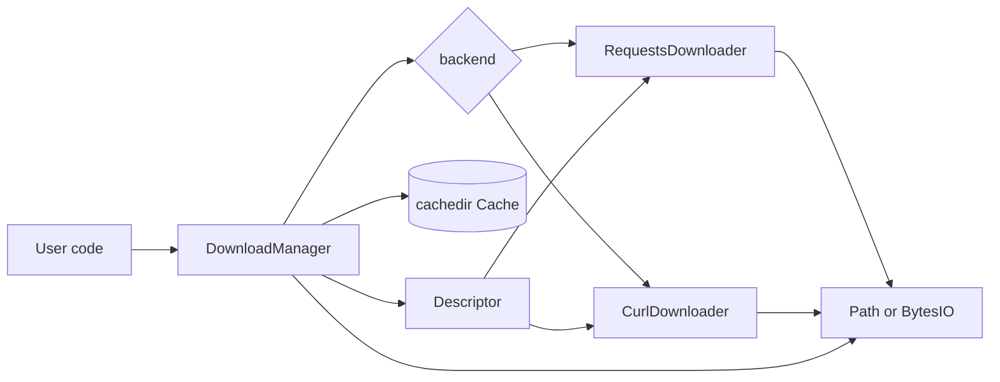
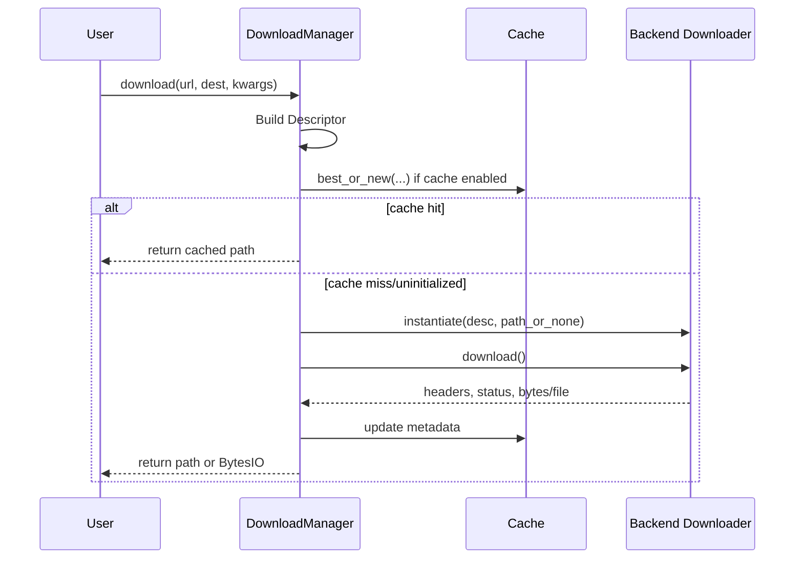

[![Tests][badge-ci]][link-ci]
[![Coverage][badge-cov]][link-cov]

[badge-cov]: https://codecov.io/github/saezlab/dlmachine/graph/badge.svg
[link-cov]: https://codecov.io/github/saezlab/dlmachine
[badge-ci]: https://img.shields.io/github/actions/workflow/status/saezlab/dlmachine/ci.yml?branch=main
[link-ci]: https://github.com/saezlab/dlmachine/actions/workflows/ci.yml

# A Download Manager Python Module

A flexible, cache-aware download manager for Python, supporting multiple backends (requests, pycurl), with integrated caching and metadata management.

---

## Features

- **Multiple Backends:** Choose between `requests` and `pycurl` for downloads.
- **Cache Integration:** Seamless integration with [`cachedir`](https://github.com/saezlab/cachedir) for efficient file reuse and metadata tracking.
- **Flexible Destinations:** Download to disk, in-memory buffer, or cache.
- **Automatic Metadata:** Tracks download status, timestamps, HTTP headers, file hashes, and more.
- **Configurable:** Supports configuration via Python dict or config file.
- **Pre-commit, Linting, and CI:** Ready for robust development workflows.

---

## Installation

```bash
pip install git+https://github.com/saezlab/dlmachine.git
```

If your are developing:
```bash
git clone https://github.com/saezlab/dlmachine.git
cd dlmachine
poetry install
```

## Usage

```python
import dlmachine as dm

# Basic download to buffer
manager = dm.DownloadManager(backend='requests')
data = manager.download('https://www.google.com', dest=False)
print(data.read())

# Download to a file
manager = dm.DownloadManager(path='/tmp')
filepath = manager.download('https://www.google.com', dest='/tmp/google.html')
print(f"Downloaded to {filepath}")

# Download with cache integration
manager = dm.DownloadManager(path='/tmp')
filepath = manager.download('https://www.google.com')
print(f"Cached at {filepath}")
```

## Architecture and Internals

The package is built around four core components:

- `DownloadManager`: orchestrates cache lookup, backend selection, retries, and metadata updates.
- `Descriptor`: normalizes request parameters (URL, query, headers, JSON, multipart, TLS CA path).
- `RequestsDownloader` and `CurlDownloader`: backend-specific implementations of the download workflow.
- `cachedir`: optional persistence layer for file reuse and download metadata.

### Component Diagram



### Runtime Flow

1. Build or accept a `Descriptor`.
2. Resolve backend from config (`requests` by default).
3. Resolve destination policy:
   - `dest='/path/file'`: force download to that path.
   - `dest=None` or `dest=True`: use cache path if cache is configured, otherwise memory buffer.
   - `dest=False`: force memory buffer.
4. If cache is enabled, look up best matching item with URI + relevant download params.
5. If no valid cached item exists, perform download and update cache metadata (status, timestamps, response headers, checksum, size, HTTP code).
6. Return either path or `io.BytesIO`.



### Practical Usage Patterns

- **In-memory processing**: use `dest=False` to get `io.BytesIO`.
- **Forced file output**: pass explicit `dest='/tmp/file.ext'`.
- **Cache-first retrieval**: initialize `DownloadManager(path='/tmp/cache')` and call `download(url)` without `dest`.
- **POST/JSON**: pass `query={...}` with `post=True` or `json=True`.
- **Multipart uploads**: pass `multipart={...}` with file paths included in the mapping.

## API Overview

- `DownloadManager`: Main interface for downloads and cache management.
- `Descriptor`: Describes a download (URL, headers, POST/GET, etc).
- `CurlDownloader`: PyCurl-based downloader.
- `RequestsDownloader`: Requests-based downloader.

## Configuration

You can configure the download manager via keyword arguments or a config file:

```python
dm.DownloadManager(
    path='/my/cache/dir',
    backend='curl',  # or 'requests'
    # ...other options
)
```

## Development
- **Linting**: `poetry run flake8 dlmachine`
- **Tests**: `poetry run pytest`
- **Coverage**: `poetry run pytest --cov`
- **Pre-commit**: Install with `pre-commit install`

## License

BSD 3-Clause License

---

## Acknowledgements
Developed by the OmniPath team at Heidelberg University Hospital.

## Citation

If you use this software, please cite the repository and the OmniPath team.
